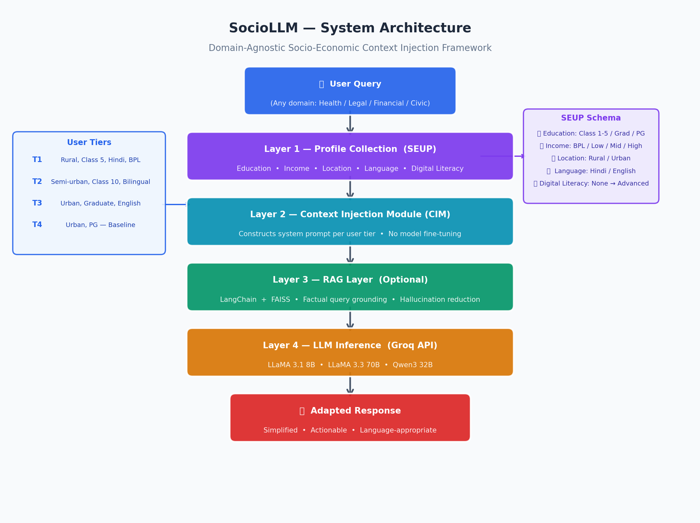
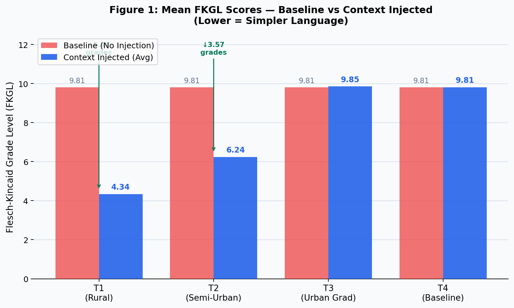
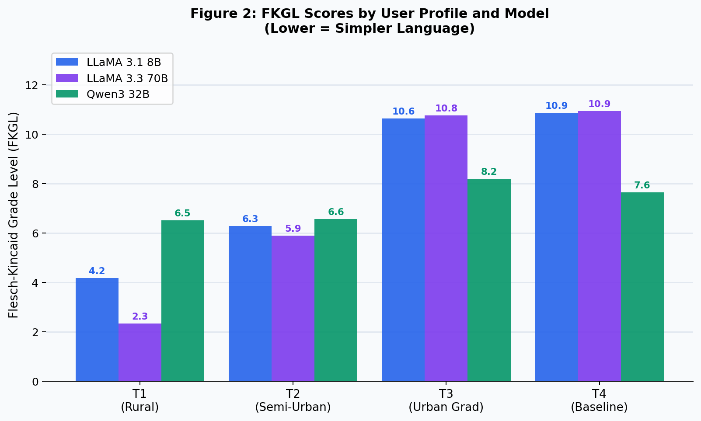
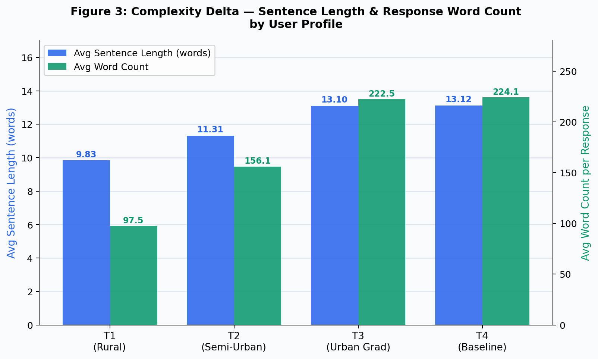
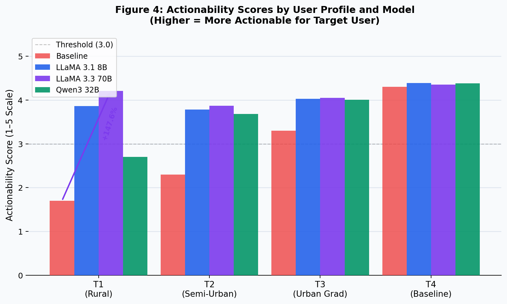
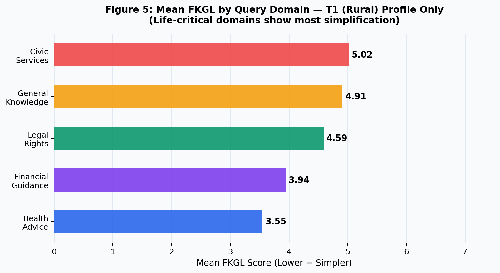

# SocioLLM: A Domain-Agnostic Socio-Economic Context Injection Framework

[](https://opensource.org/licenses/MIT)
[](https://www.python.org/)
[](https://groq.com)
[](https://www.ijrpr.com)

> **SocioLLM: A Domain-Agnostic Socio-Economic Context Injection Framework for Adaptive Response Generation in Low-Resource User Settings**
>
> **Abhinav Kumar Chaudhary, Neetu Rajput**
> Noida Institute of Engineering and Technology, Greater Noida, India
> *International Journal of Research Publication and Reviews (IJRPR), Vol. 9, Issue 5, 2026*

---

## 🔍 Overview

Large Language Models (LLMs) deliver identical responses to every user — regardless of education level, income, language, or digital literacy. A rural user in Bihar asking about chest pain receives the same complex clinical response as a specialist doctor, making it incomprehensible and useless.

**SocioLLM** solves this by injecting structured socio-economic context into LLM prompts — **no fine-tuning required**. It adapts responses based on a 5-dimension **Socio-Economic User Profile (SEUP)**.

---

## 🏗️ System Architecture



---

## 📊 Key Results

Evaluated on **1,200 response pairs** — 100 queries × 4 user tiers × 3 models.

### FKGL — Baseline vs Context Injected



### FKGL by Profile and Model



### Complexity Delta — Sentence Length & Word Count



### Actionability Scores



### Domain-wise FKGL (T1 Rural Profile)



---

## 📈 Results Summary

| User Profile | FKGL (Baseline) | FKGL (Injected) | Reduction |
|---|---|---|---|
| T1 — Rural, Class 5 | 9.81 | 4.34 | **↓ 5.47 grades** |
| T2 — Semi-Urban, Class 10 | 9.81 | 6.24 | ↓ 3.57 grades |
| T3 — Urban, Graduate | 9.81 | 9.85 | ≈ No change |
| T4 — Urban, PG (Baseline) | 9.81 | 9.81 | — |

| Metric | Result |
|---|---|
| Actionability improvement (T1, LLaMA 70B) | **+147.6%** (1.70 → 4.21) |
| Sentence length reduction (T1) | **↓ 25.1%** (13.12 → 9.83 words) |
| Word count reduction (T1) | **↓ 56.5%** (224.1 → 97.5 words) |
| Inter-rater agreement | **κ = 0.81** (Strong) |

---

## 👥 User Profiles (SEUP Tiers)

| Tier | Description | Language | Injection |
|---|---|---|---|
| **T1** | Rural, Class 5, Below Poverty Line | Hindi only | Max simplification |
| **T2** | Semi-Urban, Class 10, Low income | Hindi-English mix | Moderate |
| **T3** | Urban, Graduate, Middle income | English | Mild |
| **T4** | Urban, PG, High income | English | None (Baseline) |

---

## 🗂️ Repository Structure

```
SocioLLM/
│
├── SocioLLM.ipynb                         # Main experiment notebook (Google Colab)
├── README.md                              # This file
│
└── result/
    ├── sociollm_results_FINAL.xlsx        # All 1,200 response pairs with metrics
    ├── fig0_architecture.png              # System architecture diagram
    ├── fig1_fkgl_baseline_vs_injected.png # FKGL comparison chart
    ├── fig2_fkgl_by_model.png             # FKGL by model chart
    ├── fig3_complexity_delta.png          # Complexity & word count chart
    ├── fig4_actionability.png             # Actionability scores chart
    └── fig5_domain_fkgl.png              # Domain-wise FKGL chart
```

---

## 🚀 How to Run

### 1. Clone the Repository
```bash
git clone https://github.com/abhinavchaudharyin/SocioLLM.git
cd SocioLLM
```

### 2. Install Dependencies
```bash
pip install groq textstat pandas openpyxl
```

### 3. Get Free API Key
Get your free API key from [groq.com](https://groq.com/keys) and paste it in the notebook:
```python
GROQ_API_KEY = "your_groq_api_key_here"
```

### 4. Run in Google Colab
Open `SocioLLM.ipynb` in Google Colab and run all cells.

The notebook will:
- Load 100 queries across 5 domains
- Run each under 4 user profiles on 3 models → 1,200 API calls
- Compute FKGL, sentence length, word count automatically
- Save results to Excel

---

## 📦 Models Used

| Model | Provider | Parameters | Access |
|---|---|---|---|
| LLaMA 3.1 8B Instruct | Meta AI | 8B | Free via Groq |
| LLaMA 3.3 70B Instruct | Meta AI | 70B | Free via Groq |
| Qwen3 32B | Alibaba Cloud | 32B | Free via Groq |

---

## 📋 Dataset

100 queries across 5 domains:

| Domain | Queries |
|---|---|
| Health Advice | 25 |
| Legal Rights | 20 |
| Financial Guidance | 20 |
| Civic Services | 20 |
| General Knowledge | 15 |


---

## 👨‍💻 Authors

**Abhinav Kumar Chaudhary**
Student, Dept. of Information Technology, NIET Greater Noida
📧 abhichiku2004@gmail.com | 🔗 [GitHub](https://github.com/abhinavchaudharyin) | [LinkedIn](https://linkedin.com/in/abhinavchaudharyin) | [Portfolio](https://abhinavchaudharyin.github.io/portfolio)

**Neetu Rajput**
Assistant Professor, Dept. of Information Technology, NIET Greater Noida
📧 neetu.rajput@niet.co.in

---

## 📜 License

MIT License — see [LICENSE](LICENSE) for details.

---

## 🙏 Acknowledgements

Gratitude to the open-source AI community — contributors of LLaMA, Qwen, LangChain, FAISS, and Groq — whose freely available tools made this research practically feasible.
